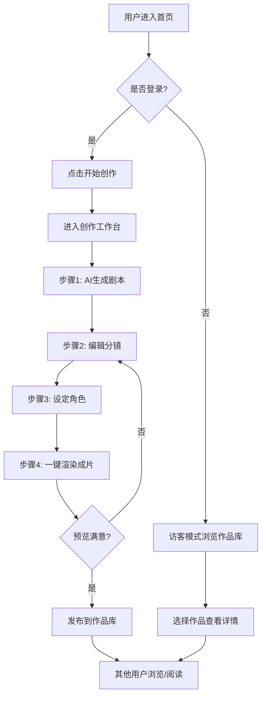

# AI 漫剧一体化整合平台 - 产品需求文档

## 1. 产品概述

**墨境 MOJING** 是一个将 AI 漫画生成与短剧创作整合的一站式 Web 平台。创作者从一句灵感出发，即可完成剧本、分镜、角色、配音到成片的全部流程。目标用户为独立创作者、短剧工作室、漫画爱好者与内容 MCN。

- 一站式打通「剧本 → 分镜 → 角色 → 成片」全链路
- 以 AI 作为创作副驾，让零基础用户也能产出可发布的漫剧作品
- 内置作品库与阅读器，形成创作—发布—浏览闭环

## 2. 核心功能

### 2.1 用户角色

| 角色 | 注册方式 | 核心权限 |
|------|----------|----------|
| 访客 | 免注册 | 浏览作品库、查看作品详情、试用创作工作台（带水印） |
| 创作者 | 邮箱/手机注册 | 全功能创作工作台、作品发布、个人主页 |
| 订阅会员 | 付费升级 | 高清导出、商用授权、专属 AI 模型、批量生成 |

### 2.2 功能模块

1. **首页**: 全屏 Hero 创作入口、AI 能力展示带、热门漫剧轮播、创作流程四步引导、数据墙
2. **创作工作台**: AI 剧本生成器、分镜板编辑器、角色卡管理、AI 渲染面板、时间轴预览
3. **作品库**: 分类标签筛选、瀑布流卡片网格、排行榜榜单、搜索栏
4. **作品详情**: 沉浸式阅读器、角色档案、创作信息、章节列表、相关推荐
5. **定价方案**: 三档套餐对比、功能矩阵、FAQ

### 2.3 页面详情

| 页面 | 模块 | 功能描述 |
|------|------|----------|
| 首页 | Hero 区 | 全屏视觉 + 动态分镜背景 + 「一句灵感，一部漫剧」CTA |
| 首页 | AI 能力展示 | 四大能力卡片：剧本/分镜/角色/成片，悬停展示效果 |
| 首页 | 热门漫剧 | 横向滚动展示热门作品，带封面、标题、热度值 |
| 首页 | 创作流程引导 | 四步流程图：输入 → 剧本 → 分镜 → 成片 |
| 首页 | 数据墙 | 平台数据：作品数、创作者数、累计播放 |
| 创作工作台 | 左侧工具栏 | 步骤切换：剧本 / 分镜 / 角色 / 渲染 |
| 创作工作台 | 剧本生成器 | 输入主题 + 风格 + 长度，AI 输出三段式剧本 |
| 创作工作台 | 分镜编辑器 | 拖拽卡片重排，每帧可编辑画面描述与对白 |
| 创作工作台 | 角色卡管理 | 角色立绘、性格标签、对话风格，AI 生成头像 |
| 创作工作台 | 渲染面板 | 选中分镜一键渲染，进度条 + 缩略图列表 |
| 作品库 | 顶部分类 | 标签云：热血/治愈/悬疑/古风/科幻/恋爱 |
| 作品库 | 瀑布流 | 响应式卡片网格，悬停显示简介 |
| 作品库 | 排行榜 | 日榜/周榜/月榜切换 |
| 作品详情 | 阅读器 | 全屏分镜阅读，左右翻页，进度条 |
| 作品详情 | 角色档案 | 主要角色卡片列表 |
| 作品详情 | 章节列表 | 章节缩略图，点击跳转 |
| 作品详情 | 相关推荐 | 同风格作品横向滚动 |
| 定价方案 | 套餐对比 | 免费版/创作者版/工作室版三列卡片 |
| 定价方案 | 功能矩阵 | 详细功能对比表 |
| 定价方案 | FAQ | 折叠式常见问题 |

## 3. 核心流程

**核心创作流程**：用户进入首页 → 点击「开始创作」→ 进入工作台 → 依次完成剧本生成、分镜编辑、角色设定、成片渲染 → 预览满意后发布 → 作品进入作品库 → 其他用户可浏览、阅读。

**浏览消费流程**：访客进入作品库 → 按分类/排行榜筛选 → 点击作品卡片 → 进入详情页阅读器 → 沉浸式翻阅分镜 → 看完查看相关推荐。

## 4. 用户界面设计

### 4.1 设计风格

**视觉概念**：「墨与霓虹」— 东方水墨意境与赛博朋克霓虹的碰撞，呼应「漫画 + AI」的双重身份。

- **主色**: 墨黑 `#0A0A0F`（背景）
- **辅助色**: 宣纸米白 `#F4EDE0`（前景文字与卡片）
- **强调色**:
  - 朱砂红 `#FF2D3D`（主 CTA、热度标识）
  - 青瓷蓝 `#00E5FF`（AI 功能、链接）
  - 鎏金黄 `#FFB800`（高亮、订阅）
- **按钮风格**: 厚重边框 + 硬阴影偏移（漫画感），主按钮朱砂红填充带 4px 黑色硬阴影
- **字体**:
  - 显示字体：`Noto Serif SC`（黑体 900），用于大标题与品牌字
  - 正文字体：`Noto Sans SC`（400/500），用于正文与 UI
  - 数字字体：`Space Mono`，用于数据、计数
- **布局**: 不对称网格、卡片重叠、对角线视觉流、漫画分格感
- **图标/风格**: 漫画式粗线条、对话气泡、网点纹理（halftone）、动作线、墨溅装饰
- **纹理**: 全局叠加 halftone 网点 + 噪点 + 偶发墨溅装饰

### 4.2 页面设计概览

| 页面 | 模块 | UI 元素 |
|------|------|--------|
| 首页 | Hero 区 | 全屏深色背景 + 动态分镜网格 + 巨型衬线标题 + 朱砂红 CTA 按钮 + 滚动指示 |
| 首页 | AI 能力展示 | 4 列卡片，悬停翻转露出动画效果，青瓷蓝高亮 |
| 首页 | 热门漫剧 | 横向滚动卡片，带热度条，悬停放大微动 |
| 首页 | 创作流程 | 4 步流程图，对角线连接，数字徽章 |
| 首页 | 数据墙 | 巨型 Space Mono 数字 + 滚动计数动画 |
| 创作工作台 | 整体布局 | 左侧固定步骤栏 + 中间主编辑区 + 右侧属性面板 |
| 创作工作台 | 剧本生成器 | 文本输入框 + 风格芯片选择 + 生成按钮 + 流式输出区 |
| 创作工作台 | 分镜编辑器 | 卡片网格 + 拖拽手柄 + 缩略图占位 + 编辑抽屉 |
| 创作工作台 | 角色卡 | 圆形头像 + 标签芯片 + 性格雷达图 |
| 创作工作台 | 渲染面板 | 进度条 + 缩略图列表 + 渲染状态徽章 |
| 作品库 | 顶部分类 | 标签云，当前选中朱砂红下划线 |
| 作品库 | 瀑布流 | CSS columns 多列，卡片带边框 + 硬阴影 |
| 作品库 | 排行榜 | 三栏 Top1/2/3 + 编号大字 + 趋势箭头 |
| 作品详情 | 阅读器 | 全屏沉浸模式，左右翻页，底部进度条 + 章节切换 |
| 作品详情 | 角色档案 | 横向卡片列表，立绘 + 简介 |
| 作品详情 | 相关推荐 | 横向滚动小卡片 |
| 定价方案 | 套餐对比 | 3 列卡片，中间「推荐」高亮 + 金色边框 |
| 定价方案 | 功能矩阵 | 表格，对勾/叉号图标 |
| 定价方案 | FAQ | 折叠式 + 展开动画 |

### 4.3 响应式

- **桌面优先**：1280px+ 完整布局，所有动效与交互全开
- **平板**：768-1280px，工作台三栏变两栏（右侧面板折叠为抽屉）
- **移动端**：<768px，单列布局，瀑布流变单列，阅读器变上下滑动
- **触控优化**：分镜卡片支持长按拖拽，阅读器支持左右滑动翻页

### 4.4 动效指引

- 页面载入：标题字符逐字浮现 + 朱砂红墨溅装饰延迟入场
- 滚动触发：各模块 IntersectionObserver 触发错峰淡入 + 上移
- 悬停：卡片带「纸张掀起」式轻微 3D 倾斜
- 工作台：分镜拖拽时显示占位虚线框
- 阅读器：翻页带漫画式「页面切换」擦除动效
- 全局：halftone 网点背景轻微视差跟随鼠标
