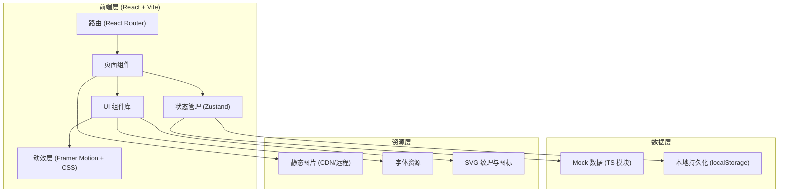
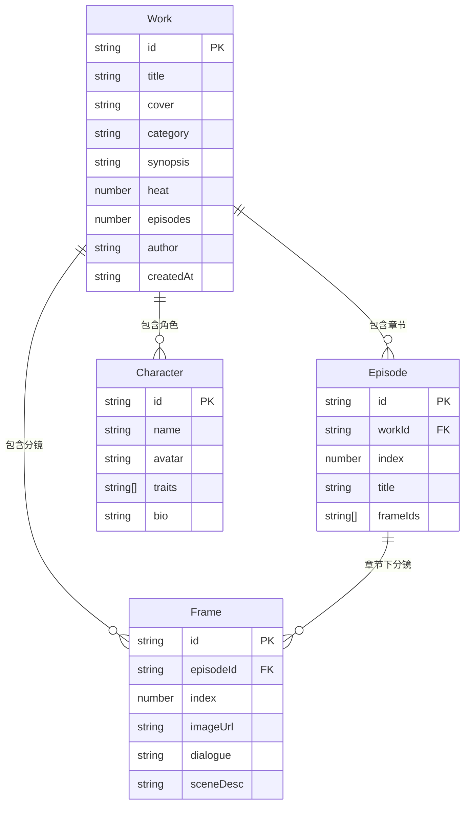

# AI 漫剧一体化整合平台 - 技术架构文档

## 1. 架构设计



## 2. 技术说明

- **前端框架**: React@18 + TypeScript
- **构建工具**: Vite@5（vite-init 脚手架）
- **样式方案**: TailwindCSS@3 + CSS 变量主题系统
- **路由**: React Router@6
- **状态管理**: Zustand（轻量，适合工作台状态）
- **动效**: Framer Motion + 原生 CSS 动画 + IntersectionObserver
- **图标**: Lucide React + 自定义 SVG（漫画风装饰）
- **字体**: Google Fonts - Noto Serif SC / Noto Sans SC / Space Mono
- **后端**: 无（前端纯展示项目，使用 Mock 数据模拟 AI 生成）
- **数据库**: 无（使用 localStorage 持久化用户草稿与偏好）

**说明**：本项目为前端演示型产品，AI 生成能力通过精心设计的 Mock 数据与流式输出动画模拟，便于后续无缝接入真实 AI 后端。

## 3. 路由定义

| 路由 | 用途 |
|------|------|
| `/` | 首页 - Hero、AI 能力、热门作品、创作流程、数据墙 |
| `/studio` | 创作工作台 - 四步骤创作流程 |
| `/library` | 作品库 - 分类筛选、瀑布流、排行榜 |
| `/work/:id` | 作品详情 - 沉浸式阅读器与角色档案 |
| `/pricing` | 定价方案 - 套餐对比与 FAQ |
| `*` | 404 页面 |

## 4. 模块划分

```
src/
├── main.tsx                    # 入口
├── App.tsx                     # 根组件 + 路由
├── index.css                   # 全局样式 + Tailwind + 主题变量
├── components/
│   ├── layout/
│   │   ├── Navbar.tsx          # 顶部导航
│   │   ├── Footer.tsx          # 页脚
│   │   └── HalftoneBg.tsx      # 全局网点背景
│   ├── ui/
│   │   ├── ComicButton.tsx     # 漫画风按钮（硬阴影）
│   │   ├── ComicCard.tsx        # 卡片容器
│   │   ├── SpeechBubble.tsx     # 对话气泡
│   │   ├── Chip.tsx            # 标签芯片
│   │   └── SectionTitle.tsx    # 章节大标题
│   └── shared/
│       ├── WorkCard.tsx        # 作品卡片
│       └── Marquee.tsx         # 横向滚动
├── pages/
│   ├── Home.tsx
│   ├── Studio.tsx
│   ├── Library.tsx
│   ├── WorkDetail.tsx
│   └── Pricing.tsx
├── store/
│   └── studioStore.ts          # 工作台状态（剧本/分镜/角色）
├── data/
│   ├── works.ts                # Mock 作品数据
│   ├── characters.ts           # Mock 角色数据
│   └── scriptTemplates.ts      # 剧本生成模板
├── hooks/
│   ├── useReveal.ts            # 滚动揭示动画
│   └── useTypewriter.ts        # 流式打字机效果
└── types/
    └── index.ts                # 类型定义
```

## 5. 数据模型



## 6. 关键类型定义

```typescript
// src/types/index.ts
export interface Work {
  id: string;
  title: string;
  cover: string;
  category: WorkCategory;
  synopsis: string;
  heat: number;
  episodes: Episode[];
  characters: Character[];
  author: string;
  createdAt: string;
  tags: string[];
}

export type WorkCategory = '热血' | '治愈' | '悬疑' | '古风' | '科幻' | '恋爱';

export interface Episode {
  id: string;
  index: number;
  title: string;
  frames: Frame[];
}

export interface Frame {
  id: string;
  index: number;
  imageUrl: string;
  dialogue: string;
  sceneDesc: string;
  characterId?: string;
}

export interface Character {
  id: string;
  name: string;
  avatar: string;
  traits: string[];
  bio: string;
  color: string;
}

export interface StudioState {
  currentStep: 'script' | 'storyboard' | 'character' | 'render';
  scriptInput: string;
  generatedScript: string;
  frames: Frame[];
  characters: Character[];
  renderProgress: number;
}
```

## 7. 设计系统（TailwindCSS 自定义）

```css
/* theme tokens */
:root {
  --color-ink: #0A0A0F;          /* 墨黑 - 主背景 */
  --color-paper: #F4EDE0;        /* 宣纸 - 前景 */
  --color-cinnabar: #FF2D3D;     /* 朱砂红 - 主强调 */
  --color-celadon: #00E5FF;      /* 青瓷蓝 - 次强调 */
  --color-gold: #FFB800;          /* 鎏金黄 - 高亮 */
  --color-ink-soft: #1A1A24;     /* 软墨 - 卡片背景 */
  --color-ink-line: #2A2A38;     /* 墨线 - 边框 */

  --shadow-comic: 4px 4px 0 0 #000;
  --shadow-comic-lg: 8px 8px 0 0 #000;
}
```

## 8. 关键交互实现要点

- **流式剧本生成**：`useTypewriter` hook 模拟 AI 文本流式输出，逐字渲染
- **分镜拖拽**：HTML5 Drag and Drop API，拖拽时显示虚线占位框
- **阅读器翻页**：Framer Motion 的 `AnimatePresence` + 漫画擦除过渡
- **滚动揭示**：`IntersectionObserver` + CSS `--delay` 变量错峰动画
- **网点背景**：SVG pattern 内联，固定定位 + 鼠标视差
- **数据计数**：`requestAnimationFrame` 实现数字滚动增长

## 9. 性能预算

- 首屏加载 < 2s（CDN 资源缓存）
- 图片懒加载（`loading="lazy"`）
- 路由级代码分割（React.lazy + Suspense）
- 字体子集化（仅加载项目用到的字符集）
- 动画优先使用 CSS transform/opacity，避免触发 layout
